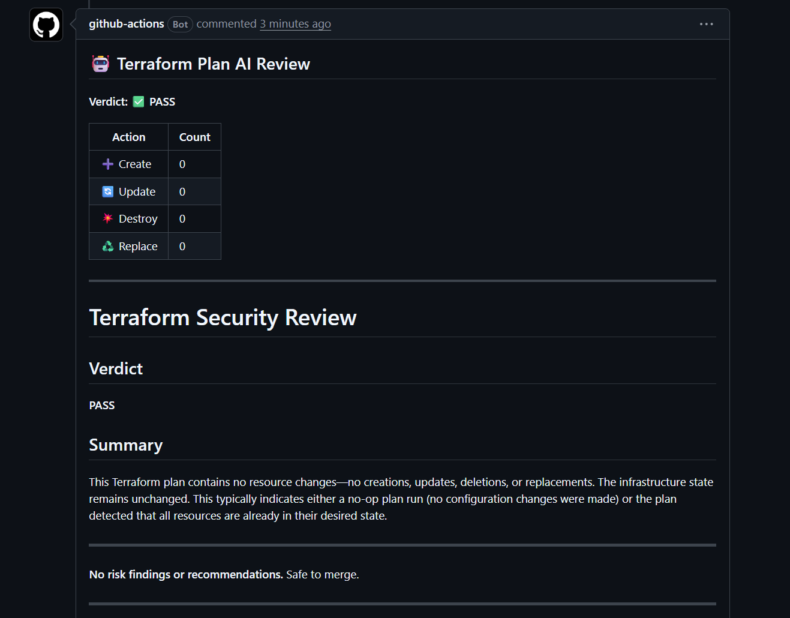

# tf-plan-ai-reviewer

[](https://github.com/marketplace/actions/terraform-plan-ai-reviewer)

A GitHub Actions composite action that reviews Terraform plan output using AI and posts a structured **PASS / WARN / BLOCK** verdict as a pull request comment.

Supports **Anthropic Claude** (default), **OpenAI**, and **Azure OpenAI** — configure by passing the appropriate API key.



---

## What it does

On every pull request that modifies Terraform configuration:

1. Parses `terraform plan -json` output into a structured summary
2. Identifies IAM/policy changes, open network ingress/egress, destructive operations, and sensitive outputs
3. Sends the summary to the configured LLM for review
4. Posts a PR comment with a verdict, summary, risk findings, and recommendations

**Verdicts:**
- `PASS` — no notable risks, safe to merge
- `WARN` — risks present but not critical; reviewer attention recommended
- `BLOCK` — destructive or high-privilege changes that must be confirmed by a human before merge

---

## Usage

Add to your Terraform workflow:

```yaml
- name: Terraform plan (JSON output)
  run: |
    terraform plan -input=false -json -var="alert_email=" \
      2>/dev/null > plan.json

- name: AI plan review
  uses: JamesIOmete/tf-plan-ai-reviewer@v1.0.0
  with:
    plan-json-path: plan.json
    anthropic-api-key: ${{ secrets.ANTHROPIC_API_KEY }}
    github-token: ${{ secrets.GITHUB_TOKEN }}
```

See [`aws-iot-edge-reference`](https://github.com/JamesIOmete/aws-iot-edge-reference) for a complete working example including the full Terraform workflow.

---

## Inputs

### Anthropic Claude (default, recommended)

| Input | Required | Default | Description |
|-------|----------|---------|-------------|
| `anthropic-api-key` | Yes* | — | Anthropic API key |
| `anthropic-model` | No | `claude-sonnet-4-5` | Claude model name |

### OpenAI

| Input | Required | Default | Description |
|-------|----------|---------|-------------|
| `openai-api-key` | Yes* | — | OpenAI API key |
| `model` | No | `gpt-4o` | OpenAI model name |

### Azure OpenAI

| Input | Required | Default | Description |
|-------|----------|---------|-------------|
| `azure-openai-endpoint` | Yes* | — | Azure OpenAI endpoint URL |
| `azure-openai-key` | Yes* | — | Azure OpenAI API key |
| `azure-openai-deployment` | No | `gpt-4o` | Deployment name |

### Common

| Input | Required | Default | Description |
|-------|----------|---------|-------------|
| `plan-json-path` | Yes | — | Workspace-relative path to `terraform plan -json` output |
| `github-token` | Yes | `${{ github.token }}` | GitHub token for posting PR comment |

**Provider selection:** Anthropic is used if `anthropic-api-key` is set. Azure OpenAI is used if `azure-openai-endpoint` is set. Otherwise OpenAI is used. Only one provider key is required.

---

## Provider examples

### Anthropic Claude

```yaml
- uses: JamesIOmete/tf-plan-ai-reviewer@v1.0.0
  with:
    plan-json-path: plan.json
    anthropic-api-key: ${{ secrets.ANTHROPIC_API_KEY }}
    anthropic-model: claude-sonnet-4-5
    github-token: ${{ secrets.GITHUB_TOKEN }}
```

### OpenAI

```yaml
- uses: JamesIOmete/tf-plan-ai-reviewer@v1.0.0
  with:
    plan-json-path: plan.json
    openai-api-key: ${{ secrets.OPENAI_API_KEY }}
    model: gpt-4o
    github-token: ${{ secrets.GITHUB_TOKEN }}
```

### Azure OpenAI

```yaml
- uses: JamesIOmete/tf-plan-ai-reviewer@v1.0.0
  with:
    plan-json-path: plan.json
    azure-openai-endpoint: ${{ secrets.AZURE_OPENAI_ENDPOINT }}
    azure-openai-key: ${{ secrets.AZURE_OPENAI_KEY }}
    azure-openai-deployment: gpt-4o
    github-token: ${{ secrets.GITHUB_TOKEN }}
```

---

## Generating plan JSON

`terraform plan -json` emits NDJSON — one object per line. The reviewer handles this format automatically:

```bash
terraform plan \
  -input=false \
  -json \
  2>/dev/null > plan.json
```

Do not use `terraform show -json tfplan` — use `terraform plan -json` directly.

---

## Repository structure

```
tf-plan-ai-reviewer/
├── action.yml              # Composite action definition
├── reviewer/
│   ├── review.py           # CLI entrypoint, NDJSON parsing, GitHub comment posting
│   ├── parser.py           # Terraform plan JSON → PlanSummary
│   ├── prompt.py           # LLM message construction
│   ├── llm.py              # Provider backends: Anthropic, OpenAI, Azure OpenAI
│   └── formatter.py        # PR comment markdown formatting
├── tests/
│   └── ...                 # Parser and integration tests
├── docs/
│   └── example-review.png  # Example PR comment output
└── requirements.txt
```

---

## Related projects

- **[multicloud-sa-toolkit](https://github.com/JamesIOmete/multicloud-sa-toolkit)** — the multi-cloud Terraform toolkit this reviewer was designed to complement. Fixture data is drawn from that toolkit's UC06 plan output.
- **[multicloud-estate-briefing](https://github.com/JamesIOmete/multicloud-estate-briefing)** — AI-powered estate briefing tool that ingests UC02 `inventory.json` artifacts and produces a natural-language summary of what's running, anomaly callouts, and recommended next actions.
- **[iot-ops-agent](https://github.com/JamesIOmete/iot-ops-agent)** — sibling AI tooling project. Where tf-plan-ai-reviewer applies LLM reasoning to a single IaC review pass, iot-ops-agent demonstrates a full agentic loop with tool use, runbook execution, and structured reasoning logs.
- **[aws-iot-edge-reference](https://github.com/JamesIOmete/aws-iot-edge-reference)** — the IoT stack whose Terraform this reviewer is used to validate in CI.
- **[tf-scaffold-ai](https://github.com/JamesIOmete/tf-scaffold-ai)** — generates working Terraform scaffolds from plain-language architecture descriptions; the upstream generative counterpart to this reviewer — scaffold there, review here.

---

## License

MIT
